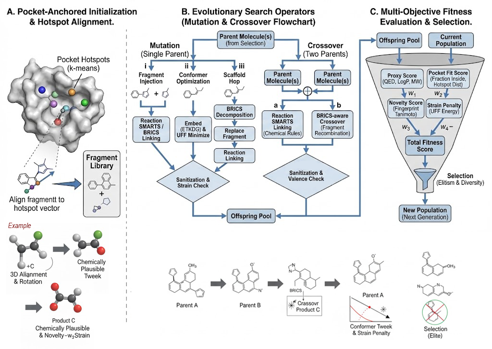

# Transcriptome-Guided Metaheuristic Assembly for De Novo Drug Design in Acute Myeloid Leukemia
**Bachelor's Thesis — Faculty of Computers and Artificial Intelligence, Cairo University, 2026**
<div align="center">


**An end-to-end in silico framework bridging transcriptomics and de novo drug discovery for AML**

[Overview](#overview) · [Pipeline](#pipeline) · [Installation](#installation) · [Usage](#usage) · [Results](#results) ·

<p align="center">
  
  <br>
  <em>Figure 1: Schematic representation of the evolutionary algorithm for de novo ligand generation</em>
</p>


</div>


## Overview


>  **The core metaheuristic ligand generation algorithm developed in this work is published as a preprint on arXiv:**  
> [**arXiv:2512.21301**](https://arxiv.org/abs/2512.21301)

This repository contains the full computational pipeline described in our **Bachelor's Thesis (2026)**:

> Abdullah G. Elafifi, Basma Mamdouh, Mariam Hanafy, Muhammed Alaa Eldin, and Yosef Khaled.
>  Under Supervision: Prof. Tarek H.M. Abou-El-Enien, Eng. Nesma Mohamed El-Gelany 
> Faculty of Computers and Artificial Intelligence, Cairo University

Acute Myeloid Leukemia (AML) remains one of the most aggressive and molecularly heterogeneous hematological malignancies, with a 5-year survival rate of only ~32.9%. This work presents a multi-stage computational framework that:

- Analyzes bulk RNA-seq data from the **TCGA-LAML** cohort (173 samples)
- Prioritizes **20 high-value biomarkers** via Weighted Gene Co-expression Network Analysis (WGCNA)
- Models target 3D structures with **AlphaFold3** and maps druggable pockets via **DOGSiteScorer**
- Generates novel AML-targeted ligands using a custom **reaction-first evolutionary metaheuristic algorithm**
- Validates candidates through **ADMET profiling** and **SwissDock molecular docking**

The top candidate, **Ligand L1**, achieved a binding free energy of **-6.571 kcal/mol** and an MM/GBSA binding free energy of **-14.43 kcal/mol** against the A0AV96 biomarker.

---

## Pipeline

```
Raw TCGA-LAML RNA-seq Data
          │
          ▼
┌─────────────────────────────┐
│  Phase 1: Transcriptomic    │  Exon-to-gene aggregation, protein-coding
│  Preprocessing              │  filtration, normalization, HVG selection
└─────────────┬───────────────┘
              │
              ▼
┌─────────────────────────────┐
│  Phase 2: Network-Based     │  WGCNA co-expression network, module
│  Target Prioritization      │  detection, hub gene identification
└─────────────┬───────────────┘
              │
              ▼
┌─────────────────────────────┐
│  Phase 3: Structural        │  AlphaFold3 structure retrieval,
│  Modeling                   │  pLDDT confidence filtering
└─────────────┬───────────────┘
              │
              ▼
┌─────────────────────────────┐
│  Phase 4: Binding-Site      │  DOGSiteScorer pocket detection,
│  Identification             │  composite druggability scoring
└─────────────┬───────────────┘
              │
              ▼
┌─────────────────────────────┐
│  Phase 5: De Novo Ligand    │  Metaheuristic fragment assembly,
│  Evolution                  │  multi-objective fitness, ADMET + docking
└─────────────────────────────┘
```


## Repository Structure

```
.
├── data/
│   ├── TCGA.LAML.sampleMap_HiSeqV2_exon.gz   # Raw TCGA-LAML exon expression matrix
│   ├── unc_v2_exon_hg19_probe_TCGA            # UNC v2 exon-to-hg19 probeMap
│   ├── gene_expression.csv                    # Gene-level expression (after step 02)
│   └── gene_expression_protein_coding.csv     # Protein-coding filtered (after step 03)
│
├── results/
│   ├── hvgs_2000.csv                          # Top 2000 HVGs
│   ├── module_eigengenes.csv                  # WGCNA module eigengenes
│   ├── intramodular_connectivity.csv          # kWithin scores per gene
│   ├── modules.json                           # Detected co-expression modules
│   ├── gene_ranking.csv                       # Full composite gene ranking
│   ├── top_biomarkers.csv                     # Top 50 biomarker candidates
│   ├── top20_biomarkers_annotated.csv         # Final top 20 with UniProt & GO annotations
│   ├── proteins_3d/
│   │   ├── structures/                        # Downloaded AlphaFold3 PDB files
│   │   ├── images_Point_Cloud/                # Per-protein point-cloud renders
│   │   └── structure_fetch_report.csv         # Download status per biomarker
│   └── <pocket_stem>_ranked_ligands.csv       # Ranked ligands output
│
├── Biomarkers_results_graphs/                 # EDA figures for top 20 biomarkers
│
├── 01_load_data.py                            # Load raw TCGA expression + probeMap
├── 02_exon_to_gene.py                         # Exon-to-gene aggregation (HUGO symbols)
├── 03_filter_protein_coding.py                # Protein-coding biotype filter (mygene)
├── 04_normalize_and_select_hvgs.py            # log2 normalization + HVG selection
├── 05_coexpression_and_modules.py             # WGCNA adjacency, modules, kWithin ranking
├── 06_EDA_for_the_filtered_genes.py           # EDA on filtered genes (PCA, UMAP, network)
├── 07_rank_hubs_and_annotate.py               # Composite biomarker scoring + UniProt annotation
├── 08_Biomarkers_EDA_1.py                     # Full EDA for top 20 biomarkers
├── 09_fetch_structures.py                     # AlphaFold3 PDB retrieval via EBI API
├── 09_viewing_proteins_old.py                 # PyVista point-cloud protein visualization
├── Ligand_generator.py                        # ⭐ Core metaheuristic ligand generation engine
├── requirements.txt
└── README.md
```


## Installation

### Prerequisites

- Python 3.8+
- Conda (recommended) or pip

### Clone the Repository

```bash
git clone https://github.com/<your-org>/aml-denovo-drug-design.git
cd aml-denovo-drug-design
```

### Create Environment

```bash
conda create -n aml-drug python=3.9
conda activate aml-drug
```

### Install Dependencies

```bash
pip install -r requirements.txt
```

Key dependencies include:

| Package | Purpose |
|---|---|
| `rdkit` | Cheminformatics — SMILES, fingerprints, QED, BRICS, UFF, conformer embedding |
| `mygene` | Gene biotype & UniProt annotation queries |
| `biopython` | PDB structure parsing for pocket coordinate extraction |
| `numpy`, `scipy`, `pandas` | Numerical computing & data wrangling |
| `scikit-learn` | PCA, K-means, StandardScaler, MinMaxScaler |
| `umap-learn` | UMAP dimensionality reduction |
| `networkx` | Co-expression network construction and community detection |
| `matplotlib`, `seaborn` | Visualization (heatmaps, violins, PCA plots, etc.) |
| `requests` | AlphaFold3 EBI API calls for PDB retrieval |
| `pyvista` | 3D point-cloud protein visualization (optional, `09_viewing_proteins_old.py`) |
| `biotite` | PDB structure reading for PyVista rendering (optional) |
| `Pillow` | Image collage generation for protein visualizations |
| `sascorer` | SA (Synthetic Accessibility) score — optional, fallback built-in |

---

## Data

### TCGA-LAML Dataset

The primary dataset is the **TCGA Acute Myeloid Leukemia exon expression** matrix (polyA+ Illumina HiSeq 2000), sourced from the [UCSC Xena Browser](https://xenabrowser.net/datapages/).

- 173 AML patient samples in TCGA barcode format (`TCGA-SS-PPPP-TT`)
- Expression values as log₂(RPKM+1)
- Requires the UNC v2 exon-to-hg19 probeMap for genomic coordinate mapping

Download instructions:
```bash
# Navigate to: https://xenabrowser.net/datapages/
# Dataset: TCGA Acute Myeloid Leukemia (LAML)
# File: TCGA.LAML.sampleMap/HiSeqV2_exon
# Place in: data/raw/
```


## Usage

Run the scripts sequentially. Each step saves its outputs to `data/` or `results/` for the next step to consume.

### Step 1 — Load Raw Data

```bash
python 01_load_data.py
```
Loads the TCGA-LAML exon expression matrix and the UNC v2 probeMap. Prints shapes to verify data integrity.

### Step 2 — Exon-to-Gene Aggregation

```bash
python 02_exon_to_gene.py
```
Maps genomic coordinates to HUGO gene symbols using the probeMap and aggregates exon-level RPKM values to gene-level means. Outputs `data/gene_expression.csv`.

### Step 3 — Protein-Coding Filtration

```bash
python 03_filter_protein_coding.py
```
Queries the `mygene` API to retain only protein-coding genes. Outputs `data/gene_expression_protein_coding.csv`.

### Step 4 — Normalization & HVG Selection

```bash
python 04_normalize_and_select_hvgs.py
```
Applies log₂(x+1) normalization, filters low-mean genes (mean < 0.5), and selects the top 2,000 highly variable genes. Outputs `results/hvgs_2000.csv`.

### Step 5 — WGCNA Co-expression Network

```bash
python 05_coexpression_and_modules.py
```
Builds a weighted adjacency matrix (soft-threshold β=6), detects co-expression modules via greedy modularity, computes module eigengenes, and calculates intramodular connectivity (kWithin). Outputs modules, eigengenes, connectivity scores, and a composite gene ranking.

### Step 6 — EDA on Filtered Genes

```bash
python 06_EDA_for_the_filtered_genes.py
```
Generates exploratory plots (expression distribution, clustered heatmap, PCA, UMAP, co-expression network) for the top 20 variance-ranked biomarkers. Outputs saved to `results_for_biomarkers/`.

### Step 7 — Hub Gene Ranking & Annotation

```bash
python 07_rank_hubs_and_annotate.py
```
Combines kWithin, expression variance, and mean expression into the composite scoring formula, annotates genes with UniProt accessions and GO terms via `mygene`, and flags surface/secreted targetability. Outputs `results/top20_biomarkers_annotated.csv`.

### Step 8 — Biomarker EDA

```bash
python 08_Biomarkers_EDA_1.py
```
Produces a full suite of figures for the final top 20 biomarkers: heatmap, PCA, correlation matrix, network graph, boxplots, violin plots, pairplot, hierarchical dendrogram, and UMAP. Outputs saved to `Biomarkers_results_graphs/`.

### Step 9 — Fetch AlphaFold3 Structures

```bash
python 09_fetch_structures.py
```
Downloads predicted 3D structures for each biomarker from the AlphaFold EBI database using UniProt accessions. Saves PDB files to `results/proteins_3d/structures/` and generates a combined protein image collage. Missing structures (e.g., VCAN) are logged automatically.

> **Optional:** `09_viewing_proteins_old.py` renders interactive PyVista point-cloud visualizations colored by pLDDT confidence scores. Requires `pyvista` and `biotite`.

### Step 10 — De Novo Ligand Generation

```bash
python Ligand_generator.py
```

Before running, edit the `__main__` block to point to your pocket PDB file and output directory:

```python
pocket_file = "path/to/your/pocket.pdb"   # pocket extracted from DOGSiteScorer
work_root   = "path/to/output/directory"
```

Key parameters (configurable in `process_de_novo_advanced_safe()`):

| Parameter | Default | Description |
|---|---|---|
| `pop_size` | 60 | GA population size |
| `generations` | 40 | Evolutionary generations |
| `hotspot_clusters` | 4 | K-means hotspot clusters in pocket |
| `seed` | 42 | Random seed for reproducibility |

**Outputs:**
- `<pocket_stem>_ranked_ligands_advanced_safe.csv` — all candidates ranked by fitness
- `<pocket_stem>_top10_grid_advanced_safe.png` — 2D structure grid of top 10 ligands
- `sdf/ligand_N.sdf` and `pdb/ligand_N.pdb` — 3D conformers for docking

The script also runs a **vanilla GA baseline** automatically and prints a side-by-side comparison of mean QED, SA, pocket fit, and final score.

---

## Methods Summary

### Biomarker Scoring

Candidate biomarkers were ranked using a composite score integrating intramodular connectivity (*k*Within), expression variance, and mean expression:

$$\text{Score} = 0.5 \times k_{Within}^{norm} + 0.3 \times Variance^{norm} + 0.2 \times Mean^{norm}$$

### Pocket Druggability Scoring

Binding pockets detected by DOGSiteScorer were scored as:

$$\text{Score} = 0.3 \cdot V + 0.2 \cdot D + 0.2 \cdot E \times 100 + 0.1 \cdot H \times 100 + 0.1 \cdot A + 0.1 \cdot (D_{HB} + A_{HB})$$

where V = volume, D = depth, E = enclosure, H = hydrophobicity, A = aromaticity, D_HB/A_HB = H-bond donors/acceptors.

### Multi-Objective Fitness Function

$$F(m) = w_p \cdot S_{proxy} + w_f \cdot S_{fit} + w_n \cdot S_{novelty} + w_s \cdot S_{strain} - \lambda \cdot P_{SA}$$

### Fragment Library

The 69-fragment library spans 8 chemical categories designed for AML-relevance:

- Privileged heteroaromatic scaffolds (kinase hinge binders)
- FLT3/IDH inhibitor-inspired pharmacophores
- Drug-likeness modulators (saturated heterocycles)
- Lipophilicity/pocket-complementarity modulators (halogenated phenyls)
- Functional groups and minimal pharmacophoric units
- Aromatic kinase hinge chemotypes
- Adaptive linkers (urea, carbamate, sulfonyl)
- AML-privileged kernel fragments

---

## Results

### Top 20 Biomarkers

| Gene | Function | Score |
|---|---|---|
| S100A9 | Pro-inflammatory alarmin (AML M4/M5) | 0.748 |
| HK3 | Myeloid glycolytic enzyme | 0.603 |
| SLC7A7 | Cationic amino acid transporter | 0.578 |
| SIGLEC9 | Immunosuppressive checkpoint receptor | 0.557 |
| LILRA5 | Innate immune / pro-inflammatory receptor | 0.558 |
| ... | ... | ... |

Full table available in `results/biomarkers/top20_biomarkers.xlsx`.

### Generated Ligands

The metaheuristic framework generated compounds with:

- QED scores concentrated between **0.5–0.7**
- SA scores averaging **~1.58** (vs. ~1.70 for vanilla GA baseline)
- Pocket Fit scores consistently **0.70–0.71**

### Top Candidate: Ligand L1

| Metric | Value |
|---|---|
| SwissDock FullFitness | **-6.571 kcal/mol** |
| CB-DOCK2 binding energy | -6.800 kcal/mol |
| MM/GBSA ΔG_bind | -14.43 ± 2.41 kcal/mol |
| Pocket Fit Score | 0.725 |
| QED | ~0.62 |
| Primary interaction | van der Waals (-19.22 kcal/mol) |

---

## External Tools & APIs

| Tool | Purpose | Reference |
|---|---|---|
| [UCSC Xena](https://xenabrowser.net) | TCGA-LAML data retrieval | — |
| [AlphaFold3](https://alphafoldserver.com) | Protein structure prediction | Abramson et al., *Nature* 2024 |
| [DOGSiteScorer / ProteinsPlus](https://proteins.plus) | Binding pocket detection | — |
| [ADMETlab 3.0](https://admetlab3.scbdd.com) | ADMET profiling | Fu et al., *NAR* 2024 |
| [SwissDock](http://www.swissdock.ch) | Molecular docking | Bugnon et al., *NAR* 2024 |
| [CB-DOCK2](https://cadd.labshare.cn/cb-dock2) | Blind docking validation | Liu et al., *NAR* 2022 |

---

## Limitations

- All validation is **in silico only**; experimental confirmation (binding assays, in vivo models) is required
- Bulk RNA-seq data averages expression across heterogeneous cell populations, potentially masking rare leukemic stem cell signals
- AlphaFold3 models may deviate from native conformations in flexible binding regions
- Docking scores rely on simplified force fields and static protein structures

---

## Future Directions

- **Experimental validation**: in vitro binding assays and patient-derived xenograft models
- **Single-cell & spatial transcriptomics**: resolve leukemic stem cells and resistant subclones
- **Multi-omics integration**: proteomics, epigenomics, and metabolomics
- **Framework extension**: generalizable to other hematologic malignancies and solid tumors

---


## Graduation Project Logbook

We maintain a detailed project logbook to document the progress, challenges, solutions, and key decisions throughout the project lifecycle. 
This continuous documentation helps with transparency, knowledge sharing, and future reference.

The journal is updated regularly by all team members and accessible via:

[Project logbook - Online Google Docs.](https://docs.google.com/document/d/1Ifa06sPZ4M2DEvV2iWkmoy1QI_wjMyzjPStyD3mMQ5U/edit?usp=sharing)

Each entry includes:
- Date and author
- Task or milestone description
- Challenges faced and solutions applied
- Next steps or follow-up actions
- Any relevant references or resources

## License

This project is licensed under the MIT License. See [LICENSE](LICENSE) for details.

> **Note:** This research received no external funding. The TCGA-LAML dataset used is publicly available. Code is available from the corresponding author upon reasonable request.

